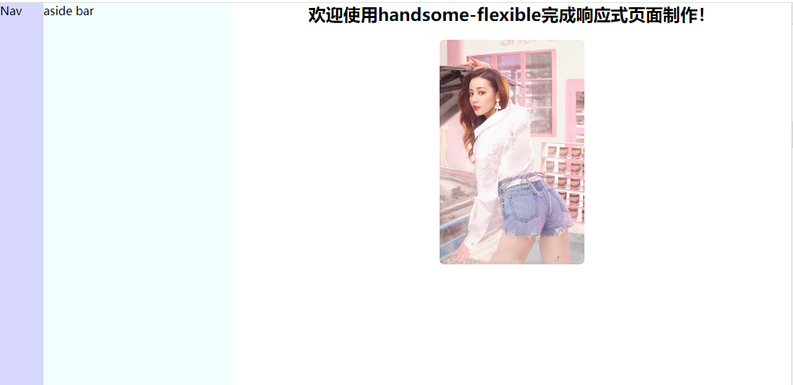

# handsome-flexible
**一个适配web和mobile页面尺寸的js库**

# 介绍

当需要一套代码同时做出适配`web`和`mobile`端的页面时，可以使用该库完成。

它基于页面的`rem`单位，控制响应式页面下的各种尺寸。

在`web`端，默认设定`1rem = 10px`. 

在`mobile`端，以`1080`尺寸为基准，设定`1.6rem = 30px`。

因此，在`web`页面设置`16px`的字体时，显示到`mobile`页面就会是`30px`。

设定`mobile`页面为`30px`，是因为该长度刚好可以在`web`端和`mobile`端正常显示，便于调试。

# 使用

将`flexible.js`引入项目。

开发中设置尺寸时，只需要使用`rem`为单位即可，即可自动适配。

# 示例

在`example`中提供了一个示例，在`web`端和`mobile`端展示效果如下：

